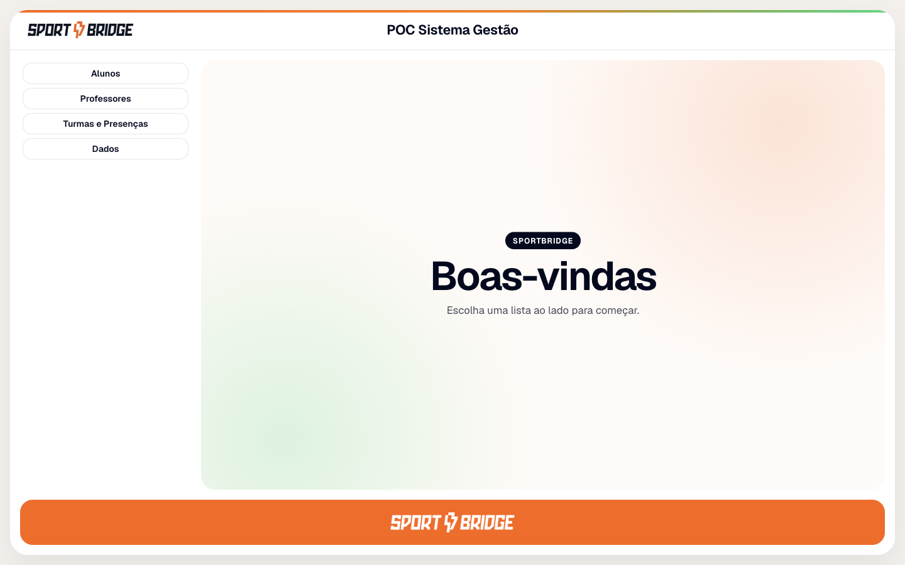
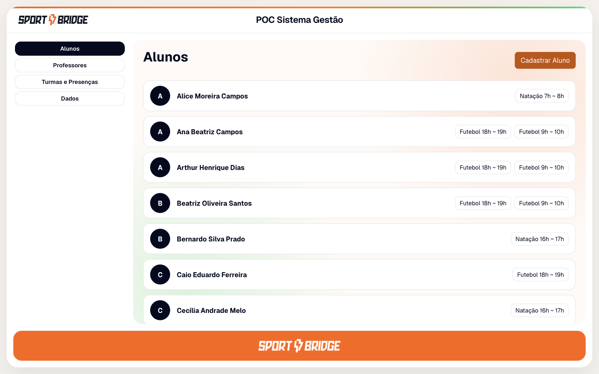
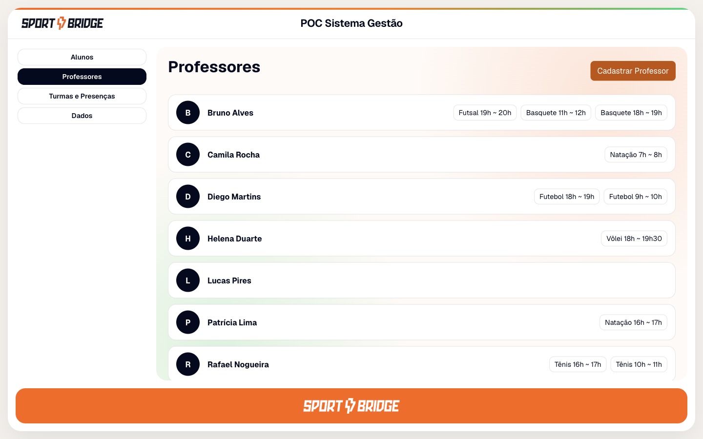
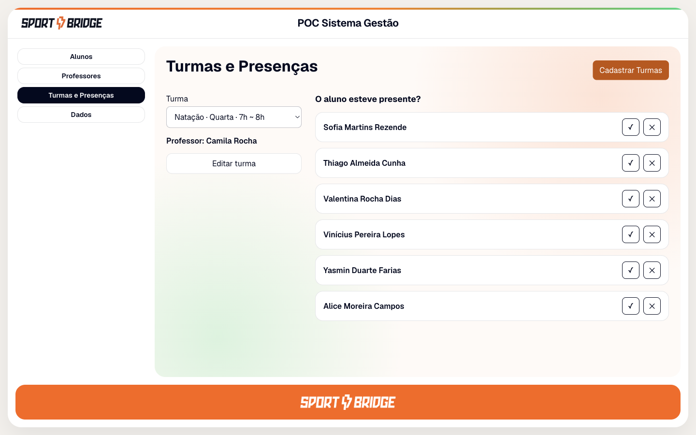
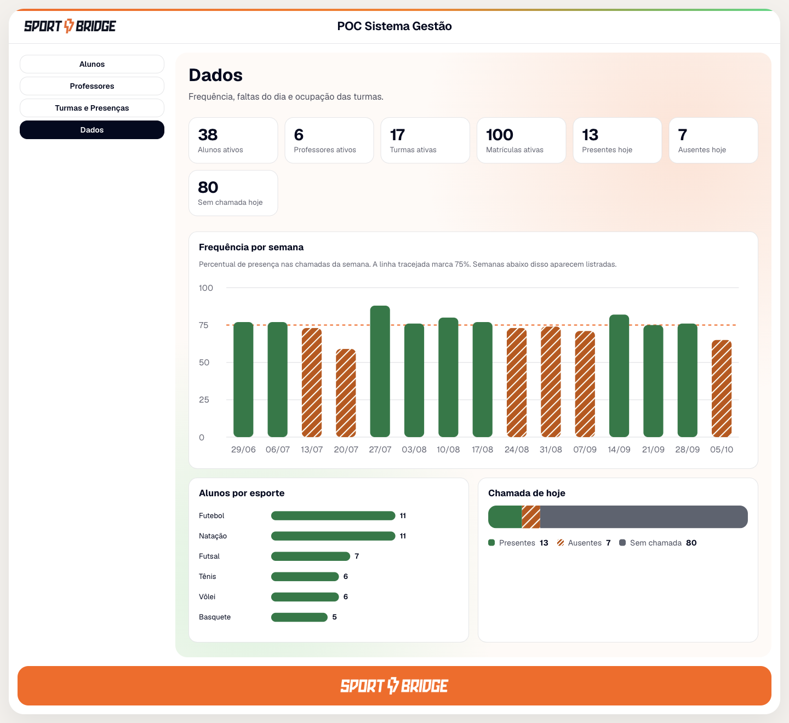

# POC Sistema Gestão

Sistema da Sportbridge para cadastrar alunos e professores, montar turmas, marcar presença e ver um painel com os números da operação.

Este guia é para quem vai **ligar o sistema no computador** e **encher as telas com dados de exemplo**. Não precisa saber programar. Cada comando está explicado.

As telas ficam no navegador, no endereço [http://localhost:3000](http://localhost:3000). As fotos estão em [As telas](#as-telas) e são as mesmas no Mac, no Linux e no Windows.

## Escolha o seu computador

- [Mac](#mac)
- [Linux](#linux)
- [Windows](#windows)
- [As telas](#as-telas)

Siga só o bloco do seu sistema, de cima a baixo.

## Mac

[Voltar ao menu](#escolha-o-seu-computador)

### Instalar no Mac

São três programas. Instale, abra, e só então continue.

1. **Docker Desktop** — é o programa que guarda os dados (o banco). Baixe em [docker.com/products/docker-desktop](https://www.docker.com/products/docker-desktop/), instale e abra. Espere o ícone da baleia aparecer na barra de cima do Mac e ficar quieto, sem animação. Enquanto a baleia estiver animada, o banco ainda está subindo.
2. **Python 3** — é a linguagem da parte que grava os dados. Baixe em [python.org/downloads](https://www.python.org/downloads/) se o teste abaixo não mostrar um número.
3. **Node.js** — é o que desenha as telas. Baixe a versão **LTS** em [nodejs.org](https://nodejs.org/).

Abra o **Terminal**: aperte Command + Espaço, digite `Terminal` e aperte Enter. Cole um comando, aperte Enter, e leia a resposta antes de colar o próximo.

```bash
docker --version
```

```bash
python3 --version
```

```bash
node --version
```

```bash
npm --version
```

Cada um deve responder com um número de versão, por exemplo `Python 3.12.0` ou `v22.0.0`. Se algum responder `command not found`, aquele programa ainda não está instalado, ou o Mac ainda não enxerga ele. Feche o Terminal e abra de novo depois de instalar.

### Primeira vez no Mac

Faça esta parte uma vez. Nos outros dias, pule para [Ligar no Mac](#ligar-no-mac).

O Docker Desktop precisa estar aberto.

No Finder, ache a pasta `POC_GESTAO`. No Terminal, digite `cd ` (com o espaço no final), arraste a pasta para a janela e aperte Enter. A linha deve terminar com `POC_GESTAO`.

Cole este bloco e aperte Enter. Ele demora um pouco na linha do `pip`: está baixando as peças do servidor.

```bash
cd back
python3 -m venv .venv
source .venv/bin/activate
pip install -r requirements.txt
cp .env.example .env
```

O que cada linha faz:

- `cd back` entra na pasta do servidor.
- `python3 -m venv .venv` cria uma caixa só deste projeto, para não misturar com outros programas do Mac.
- `source .venv/bin/activate` abre essa caixa. O começo da linha passa a mostrar `(.venv)`.
- `pip install -r requirements.txt` baixa o que o servidor precisa.
- `cp .env.example .env` copia a configuração local: nome do banco, usuário `poc` e senha `poc`. Esse arquivo fica só na sua máquina.

Se o começo da linha não mostrar `(.venv)`, rode de novo `source .venv/bin/activate` antes de continuar.

```bash
cd ../front
npm install
```

`cd ../front` sai do servidor e entra na pasta das telas. `npm install` baixa o que o navegador precisa para desenhar o sistema. Também demora na primeira vez.

```bash
cd ..
```

A linha deve terminar de novo com `POC_GESTAO`, sem `back` nem `front` no caminho.

### Ligar no Mac

Faça isto sempre que for usar. São três partes. A primeira aba você já tem, na pasta `POC_GESTAO`. Para abrir outra aba na mesma pasta, aperte Command + T. Confira se a linha da aba nova termina com `POC_GESTAO`.

1. Abra o **Docker Desktop** e espere a baleia ficar quieta.
2. Na primeira aba, suba o banco:

```bash
docker compose up -d
```

Na primeira vez isso pode levar alguns minutos: o Docker baixa a imagem do Postgres. Quando a linha voltar a aceitar comandos, confira se o banco respondeu:

```bash
docker compose exec postgres pg_isready -U poc -d poc_gestao
```

A resposta boa termina com `accepting connections`.

3. Abra uma segunda aba (Command + T) e suba o servidor:

```bash
cd back
source .venv/bin/activate
python manage.py migrate
python manage.py runserver 127.0.0.1:8000
```

`migrate` cria as tabelas, se ainda não existirem. Espere a linha `Starting development server at http://127.0.0.1:8000/`. Essa aba fica ocupada enquanto o servidor estiver ligado.

4. Abra uma terceira aba (Command + T) e suba as telas:

```bash
cd front
npm run dev
```

Espere a linha `Local: http://localhost:3000`. Essa aba também fica ocupada.

5. Abra [http://localhost:3000](http://localhost:3000). O que aparece está em [As telas](#as-telas).

Deixe as três abas abertas enquanto usa o sistema. Os cadastros continuam no banco para a próxima vez.

### Dados de exemplo no Mac

O sistema sobe vazio. O comando abaixo, chamado de seed, cria uma escolinha fictícia em Ibitinga (SP): alunos, professores, esportes, turmas e o histórico de presença de cerca de três meses, até o dia de hoje. Nomes, CPF e telefone são inventados.

**Esse comando apaga o que já estiver cadastrado** — alunos, professores, esportes, turmas, matrículas e presenças — e coloca o exemplo no lugar. Use para ver as telas cheias, ou para recomeçar do zero. Se você já tiver digitado gente de verdade e quiser manter, não rode.

O banco e o servidor precisam estar ligados. A aba do servidor já mostra `Starting development server`.

1. Volte para a primeira aba, a do banco. Ela está livre. A aba do servidor e a das telas estão ocupadas: o que você digitar ali vai para o programa que está rodando, não para o seed.
2. Confira se a linha termina com `POC_GESTAO`. Se estiver dentro de `back` ou `front`, rode `cd ..` até chegar na pasta do projeto.
3. Cole:

```bash
cd back
source .venv/bin/activate
python manage.py seed_operacao
```

Espere a mensagem verde **Operação simulada gravada.** Em seguida o terminal mostra o período e as quantidades, no formato:

```text
Alunos 40, professores 7, esportes 6, turmas 18, matrículas ..., presenças ....
```

Os números de matrículas e presenças mudam conforme o dia em que você roda, porque o exemplo vai até hoje.

4. Volte ao navegador e atualize a página (Command + R).

Pode rodar o mesmo comando de novo sempre que quiser trocar tudo pelo exemplo outra vez.

### Desligar no Mac

Nas abas do servidor e das telas, aperte Control + C. A linha volta a aceitar comandos. Na aba da pasta `POC_GESTAO`, pare o banco:

```bash
docker compose down
```

Os cadastros continuam guardados. Na próxima vez, repita [Ligar no Mac](#ligar-no-mac).

Para apagar também os cadastros e o banco, com o sistema já parado, cole na pasta `POC_GESTAO`:

```bash
docker compose down -v
```

O `-v` remove o volume, que é o arquivo onde o Postgres guarda tudo. Na subida seguinte o `migrate` cria as tabelas vazias de novo. Para ver as telas cheias, rode o seed outra vez.

### Problemas no Mac

- **`docker: command not found` ou erro de conexão com o Docker.** Abra o Docker Desktop, espere a baleia ficar quieta, e rode o comando de novo.
- **A página diz que não foi possível falar com a API.** A aba do servidor ainda não chegou na linha `Starting development server`. Espere e atualize o navegador.
- **`source: .venv/bin/activate: No such file or directory`.** A preparação da primeira vez não foi feita. Volte a [Primeira vez no Mac](#primeira-vez-no-mac), a partir da pasta `back`.
- **`npm: command not found`.** O Node.js não está instalado, ou o Terminal foi aberto antes da instalação. Instale o Node, feche o Terminal e abra de novo.
- **O seed responde que não consegue conectar, ou que a tabela não existe.** O banco precisa responder `accepting connections` e o servidor precisa estar na linha `Starting development server`. Aí rode o seed na aba do banco.
- **A porta 3000 ou 8000 já está em uso.** O sistema ficou ligado numa aba antiga. Aperte Control + C nessa aba, ou feche a janela do Terminal, e suba de novo.

## Linux

[Voltar ao menu](#escolha-o-seu-computador)

### Instalar no Linux

São três programas. Instale, abra, e só então continue.

1. **Docker Desktop** — é o programa que guarda os dados (o banco). Baixe em [docker.com/products/docker-desktop](https://www.docker.com/products/docker-desktop/), instale e abra. Espere o ícone da baleia aparecer na barra de cima e ficar quieto, sem animação.
2. **Python 3** — é a linguagem da parte que grava os dados. No Ubuntu ele costuma já estar instalado. Se o teste abaixo não mostrar um número, baixe em [python.org/downloads](https://www.python.org/downloads/) ou, no Ubuntu, cole no terminal: `sudo apt install python3 python3-venv python3-pip`.
3. **Node.js** — é o que desenha as telas. Baixe a versão **LTS** em [nodejs.org](https://nodejs.org/).

Abra o terminal. No Ubuntu e em vários outros sistemas, aperte Ctrl + Alt + T. Cole um comando, aperte Enter, e leia a resposta antes de colar o próximo.

```bash
docker --version
```

```bash
python3 --version
```

```bash
node --version
```

```bash
npm --version
```

Cada um deve responder com um número de versão, por exemplo `Python 3.12.0` ou `v22.0.0`. Se algum responder `command not found`, aquele programa ainda não está instalado. Feche o terminal e abra de novo depois de instalar.

### Primeira vez no Linux

Faça esta parte uma vez. Nos outros dias, pule para [Ligar no Linux](#ligar-no-linux).

O Docker Desktop precisa estar aberto.

No gerenciador de arquivos, ache a pasta `POC_GESTAO`. No terminal, digite `cd ` (com o espaço no final), arraste a pasta para a janela e aperte Enter. A linha deve terminar com `POC_GESTAO`.

Cole este bloco e aperte Enter. Ele demora um pouco na linha do `pip`: está baixando as peças do servidor.

```bash
cd back
python3 -m venv .venv
source .venv/bin/activate
pip install -r requirements.txt
cp .env.example .env
```

O que cada linha faz:

- `cd back` entra na pasta do servidor.
- `python3 -m venv .venv` cria uma caixa só deste projeto, para não misturar com outros programas.
- `source .venv/bin/activate` abre essa caixa. O começo da linha passa a mostrar `(.venv)`.
- `pip install -r requirements.txt` baixa o que o servidor precisa.
- `cp .env.example .env` copia a configuração local: nome do banco, usuário `poc` e senha `poc`. Esse arquivo fica só na sua máquina.

Se o começo da linha não mostrar `(.venv)`, rode de novo `source .venv/bin/activate` antes de continuar.

```bash
cd ../front
npm install
```

`cd ../front` sai do servidor e entra na pasta das telas. `npm install` baixa o que o navegador precisa para desenhar o sistema. Também demora na primeira vez.

```bash
cd ..
```

A linha deve terminar de novo com `POC_GESTAO`, sem `back` nem `front` no caminho.

### Ligar no Linux

Faça isto sempre que for usar. São três partes. A primeira aba você já tem, na pasta `POC_GESTAO`. Para abrir outra aba na mesma pasta, aperte Ctrl + Shift + T. Confira se a linha da aba nova termina com `POC_GESTAO`.

1. Abra o **Docker Desktop** e espere a baleia ficar quieta.
2. Na primeira aba, suba o banco:

```bash
docker compose up -d
```

Na primeira vez isso pode levar alguns minutos: o Docker baixa a imagem do Postgres. Quando a linha voltar a aceitar comandos, confira se o banco respondeu:

```bash
docker compose exec postgres pg_isready -U poc -d poc_gestao
```

A resposta boa termina com `accepting connections`.

3. Abra uma segunda aba (Ctrl + Shift + T) e suba o servidor:

```bash
cd back
source .venv/bin/activate
python manage.py migrate
python manage.py runserver 127.0.0.1:8000
```

`migrate` cria as tabelas, se ainda não existirem. Espere a linha `Starting development server at http://127.0.0.1:8000/`. Essa aba fica ocupada enquanto o servidor estiver ligado.

4. Abra uma terceira aba (Ctrl + Shift + T) e suba as telas:

```bash
cd front
npm run dev
```

Espere a linha `Local: http://localhost:3000`. Essa aba também fica ocupada.

5. Abra [http://localhost:3000](http://localhost:3000). O que aparece está em [As telas](#as-telas).

Deixe as três abas abertas enquanto usa o sistema. Os cadastros continuam no banco para a próxima vez.

### Dados de exemplo no Linux

O sistema sobe vazio. O comando abaixo, chamado de seed, cria uma escolinha fictícia em Ibitinga (SP): alunos, professores, esportes, turmas e o histórico de presença de cerca de três meses, até o dia de hoje. Nomes, CPF e telefone são inventados.

**Esse comando apaga o que já estiver cadastrado** — alunos, professores, esportes, turmas, matrículas e presenças — e coloca o exemplo no lugar. Use para ver as telas cheias, ou para recomeçar do zero. Se você já tiver digitado gente de verdade e quiser manter, não rode.

O banco e o servidor precisam estar ligados. A aba do servidor já mostra `Starting development server`.

1. Volte para a primeira aba, a do banco. Ela está livre. A aba do servidor e a das telas estão ocupadas: o que você digitar ali vai para o programa que está rodando, não para o seed.
2. Confira se a linha termina com `POC_GESTAO`. Se estiver dentro de `back` ou `front`, rode `cd ..` até chegar na pasta do projeto.
3. Cole:

```bash
cd back
source .venv/bin/activate
python manage.py seed_operacao
```

Espere a mensagem verde **Operação simulada gravada.** Em seguida o terminal mostra o período e as quantidades, no formato:

```text
Alunos 40, professores 7, esportes 6, turmas 18, matrículas ..., presenças ....
```

Os números de matrículas e presenças mudam conforme o dia em que você roda, porque o exemplo vai até hoje.

4. Volte ao navegador e atualize a página (Ctrl + R).

Pode rodar o mesmo comando de novo sempre que quiser trocar tudo pelo exemplo outra vez.

### Desligar no Linux

Nas abas do servidor e das telas, aperte Ctrl + C. A linha volta a aceitar comandos. Na aba da pasta `POC_GESTAO`, pare o banco:

```bash
docker compose down
```

Os cadastros continuam guardados. Na próxima vez, repita [Ligar no Linux](#ligar-no-linux).

Para apagar também os cadastros e o banco, com o sistema já parado, cole na pasta `POC_GESTAO`:

```bash
docker compose down -v
```

O `-v` remove o volume, que é o arquivo onde o Postgres guarda tudo. Na subida seguinte o `migrate` cria as tabelas vazias de novo. Para ver as telas cheias, rode o seed outra vez.

### Problemas no Linux

- **`docker: command not found` ou erro de conexão com o Docker.** Abra o Docker Desktop, espere a baleia ficar quieta, e rode o comando de novo.
- **`permission denied` ao falar com o Docker.** O seu usuário ainda não tem licença para usar o Docker. Cole `sudo usermod -aG docker $USER`, aperte Enter, saia da sua conta e entre de novo. Aí repita o comando.
- **A página diz que não foi possível falar com a API.** A aba do servidor ainda não chegou na linha `Starting development server`. Espere e atualize o navegador.
- **`ensurepip is not available` ou falha ao criar `.venv`.** No Ubuntu, cole `sudo apt install python3-venv` e rode de novo o bloco da [Primeira vez no Linux](#primeira-vez-no-linux).
- **`source: .venv/bin/activate: No such file or directory`.** A preparação da primeira vez não foi feita. Volte a [Primeira vez no Linux](#primeira-vez-no-linux), a partir da pasta `back`.
- **`npm: command not found`.** O Node.js não está instalado, ou o terminal foi aberto antes da instalação. Instale o Node, feche o terminal e abra de novo.
- **O seed responde que não consegue conectar, ou que a tabela não existe.** O banco precisa responder `accepting connections` e o servidor precisa estar na linha `Starting development server`. Aí rode o seed na aba do banco.
- **A porta 3000 ou 8000 já está em uso.** O sistema ficou ligado numa aba antiga. Aperte Ctrl + C nessa aba, ou feche a janela do terminal, e suba de novo.

## Windows

[Voltar ao menu](#escolha-o-seu-computador)

### Instalar no Windows

São três programas. Instale, abra, e só então continue.

1. **Docker Desktop** — é o programa que guarda os dados (o banco). Baixe em [docker.com/products/docker-desktop](https://www.docker.com/products/docker-desktop/), instale e abra. Se o instalador pedir o WSL 2, aceite e reinicie o computador se ele pedir. Espere o ícone da baleia ficar quieto na bandeja, ao lado do relógio (seta ^ para mostrar os ícones escondidos).
2. **Python 3** — é a linguagem da parte que grava os dados. Baixe em [python.org/downloads](https://www.python.org/downloads/). Na primeira tela do instalador, marque **Add python.exe to PATH** e só então clique em Install.
3. **Node.js** — é o que desenha as telas. Baixe a versão **LTS** em [nodejs.org](https://nodejs.org/) e avance o instalador até o fim.

Abra o **PowerShell**: aperte a tecla Windows, digite `PowerShell` e aperte Enter. Cole um comando, aperte Enter, e leia a resposta antes de colar o próximo.

```powershell
docker --version
```

```powershell
python --version
```

```powershell
node --version
```

```powershell
npm --version
```

Cada um deve responder com um número de versão, por exemplo `Python 3.12.0` ou `v22.0.0`. Se algum responder que o comando não foi reconhecido, aquele programa ainda não está instalado, ou o Windows ainda não enxerga ele. Feche o PowerShell e abra de novo depois de instalar.

### Primeira vez no Windows

Faça esta parte uma vez. Nos outros dias, pule para [Ligar no Windows](#ligar-no-windows).

O Docker Desktop precisa estar aberto.

No Explorador de Arquivos, ache a pasta `POC_GESTAO`. No PowerShell, digite `cd ` (com o espaço no final), arraste a pasta para a janela e aperte Enter. A linha deve terminar com `POC_GESTAO`.

Cole este bloco e aperte Enter. Ele demora um pouco na linha do `pip`: está baixando as peças do servidor.

```powershell
cd back
python -m venv .venv
.\.venv\Scripts\Activate.ps1
pip install -r requirements.txt
copy .env.example .env
```

O que cada linha faz:

- `cd back` entra na pasta do servidor.
- `python -m venv .venv` cria uma caixa só deste projeto, para não misturar com outros programas.
- `.\.venv\Scripts\Activate.ps1` abre essa caixa. O começo da linha passa a mostrar `(.venv)`.
- `pip install -r requirements.txt` baixa o que o servidor precisa.
- `copy .env.example .env` copia a configuração local: nome do banco, usuário `poc` e senha `poc`. Esse arquivo fica só na sua máquina.

Se aparecer um texto vermelho falando em política de execução (`execution policy`), cole a linha abaixo, aperte Enter, e rode de novo `.\.venv\Scripts\Activate.ps1`:

```powershell
Set-ExecutionPolicy -Scope CurrentUser RemoteSigned
```

Isso libera, para o seu usuário, rodar o script que abre a caixa do projeto. Confirme com `S` se o PowerShell perguntar.

Se o começo da linha não mostrar `(.venv)`, rode de novo `.\.venv\Scripts\Activate.ps1` antes de continuar.

```powershell
cd ..\front
npm install
```

`cd ..\front` sai do servidor e entra na pasta das telas. `npm install` baixa o que o navegador precisa para desenhar o sistema. Também demora na primeira vez.

```powershell
cd ..
```

A linha deve terminar de novo com `POC_GESTAO`, sem `back` nem `front` no caminho.

### Ligar no Windows

Faça isto sempre que for usar. São três janelas do PowerShell. Uma aba nova (Ctrl + Shift + T, no Terminal do Windows) costuma abrir na sua pasta de usuário, não na do projeto. Em cada janela nova, digite `cd `, arraste a pasta `POC_GESTAO` de novo e aperte Enter.

1. Abra o **Docker Desktop** e espere a baleia ficar quieta.
2. Na primeira janela, suba o banco:

```powershell
docker compose up -d
```

Na primeira vez isso pode levar alguns minutos: o Docker baixa a imagem do Postgres. Quando a linha voltar a aceitar comandos, confira se o banco respondeu:

```powershell
docker compose exec postgres pg_isready -U poc -d poc_gestao
```

A resposta boa termina com `accepting connections`.

3. Abra uma segunda janela e suba o servidor:

```powershell
cd back
.\.venv\Scripts\Activate.ps1
python manage.py migrate
python manage.py runserver 127.0.0.1:8000
```

`migrate` cria as tabelas, se ainda não existirem. Espere a linha `Starting development server at http://127.0.0.1:8000/`. Essa janela fica ocupada enquanto o servidor estiver ligado.

4. Abra uma terceira janela, entre de novo na pasta `POC_GESTAO`, e suba as telas:

```powershell
cd front
npm run dev
```

Espere a linha `Local: http://localhost:3000`. Essa janela também fica ocupada.

5. Abra [http://localhost:3000](http://localhost:3000). O que aparece está em [As telas](#as-telas).

Deixe as três janelas abertas enquanto usa o sistema. Os cadastros continuam no banco para a próxima vez.

### Dados de exemplo no Windows

O sistema sobe vazio. O comando abaixo, chamado de seed, cria uma escolinha fictícia em Ibitinga (SP): alunos, professores, esportes, turmas e o histórico de presença de cerca de três meses, até o dia de hoje. Nomes, CPF e telefone são inventados.

**Esse comando apaga o que já estiver cadastrado** — alunos, professores, esportes, turmas, matrículas e presenças — e coloca o exemplo no lugar. Use para ver as telas cheias, ou para recomeçar do zero. Se você já tiver digitado gente de verdade e quiser manter, não rode.

O banco e o servidor precisam estar ligados. A janela do servidor já mostra `Starting development server`.

1. Volte para a primeira janela, a do banco. Ela está livre. A janela do servidor e a das telas estão ocupadas: o que você digitar ali vai para o programa que está rodando, não para o seed.
2. Confira se a linha termina com `POC_GESTAO`. Se estiver dentro de `back` ou `front`, rode `cd ..` até chegar na pasta do projeto.
3. Cole:

```powershell
cd back
.\.venv\Scripts\Activate.ps1
python manage.py seed_operacao
```

Espere a mensagem verde **Operação simulada gravada.** Em seguida o PowerShell mostra o período e as quantidades, no formato:

```text
Alunos 40, professores 7, esportes 6, turmas 18, matrículas ..., presenças ....
```

Os números de matrículas e presenças mudam conforme o dia em que você roda, porque o exemplo vai até hoje.

4. Volte ao navegador e atualize a página (Ctrl + R).

Pode rodar o mesmo comando de novo sempre que quiser trocar tudo pelo exemplo outra vez.

### Desligar no Windows

Nas janelas do servidor e das telas, aperte Ctrl + C. A linha volta a aceitar comandos. Na janela da pasta `POC_GESTAO`, pare o banco:

```powershell
docker compose down
```

Os cadastros continuam guardados. Na próxima vez, repita [Ligar no Windows](#ligar-no-windows).

Para apagar também os cadastros e o banco, com o sistema já parado, cole na pasta `POC_GESTAO`:

```powershell
docker compose down -v
```

O `-v` remove o volume, que é o arquivo onde o Postgres guarda tudo. Na subida seguinte o `migrate` cria as tabelas vazias de novo. Para ver as telas cheias, rode o seed outra vez.

### Problemas no Windows

- **`docker` não é reconhecido, ou erro de conexão com o Docker.** Abra o Docker Desktop, espere a baleia ficar quieta, e rode o comando de novo. Se o instalador pediu reinício por causa do WSL 2, reinicie o computador.
- **A página diz que não foi possível falar com a API.** A janela do servidor ainda não chegou na linha `Starting development server`. Espere e atualize o navegador.
- **Texto vermelho sobre `execution policy`.** Cole `Set-ExecutionPolicy -Scope CurrentUser RemoteSigned`, confirme, e rode de novo `.\.venv\Scripts\Activate.ps1`.
- **`Activate.ps1` não encontrado.** A preparação da primeira vez não foi feita. Volte a [Primeira vez no Windows](#primeira-vez-no-windows), a partir da pasta `back`.
- **`python` não é reconhecido.** Instale o Python de novo e marque **Add python.exe to PATH**. Feche o PowerShell e abra outro.
- **`npm` não é reconhecido.** O Node.js não está instalado, ou o PowerShell foi aberto antes da instalação. Instale o Node, feche o PowerShell e abra de novo.
- **O seed responde que não consegue conectar, ou que a tabela não existe.** O banco precisa responder `accepting connections` e o servidor precisa estar na linha `Starting development server`. Aí rode o seed na janela do banco.
- **A porta 3000 ou 8000 já está em uso.** O sistema ficou ligado numa janela antiga. Aperte Ctrl + C nessa janela, ou feche ela, e suba de novo.

## As telas

O menu da esquerda é o mesmo em todas. Abaixo, cada tela com os dados de exemplo já carregados.

[Voltar ao menu](#escolha-o-seu-computador)

### Início

A primeira página. Os quatro botões da esquerda levam para o resto do sistema.



### Alunos

Lista de alunos. À direita de cada nome aparecem as turmas em que a pessoa está matriculada, no formato esporte e horário. **Cadastrar Aluno** abre o formulário. Clicar no nome abre a ficha para editar.



### Professores

A mesma ideia da lista de alunos. Cada professor mostra as turmas em que dá aula. **Cadastrar Professor** abre o formulário, e o clique no nome abre a ficha.



### Turmas e Presenças

Escolha a turma no menu. O nome do professor aparece embaixo. Em cada aluno, o botão de visto marca presença e o de xis marca falta, sempre na data de hoje. **Cadastrar Turmas** cria uma turma nova. **Editar turma** altera a turma selecionada. Clicar no nome do aluno abre a ficha dele.



### Dados

Números do dia e três gráficos: frequência das últimas semanas (a linha tracejada é 75%), alunos por esporte e a chamada de hoje. Mais para baixo, na mesma página, ficam as faltas de hoje e as tabelas de frequência por aluno, por turma e por esporte. Role a página para vê-las. Abaixo de 75% o número fica em destaque.



## Onde fica cada pasta

Serve para não se perder quando o guia pede `cd`.

| Pasta ou arquivo | O que é |
| --- | --- |
| `back` | Servidor e banco de comandos, inclusive o seed |
| `front` | Telas que abrem no navegador |
| `docker-compose.yml` | Receita do banco |
| `docs/telas` | Fotos deste guia |
